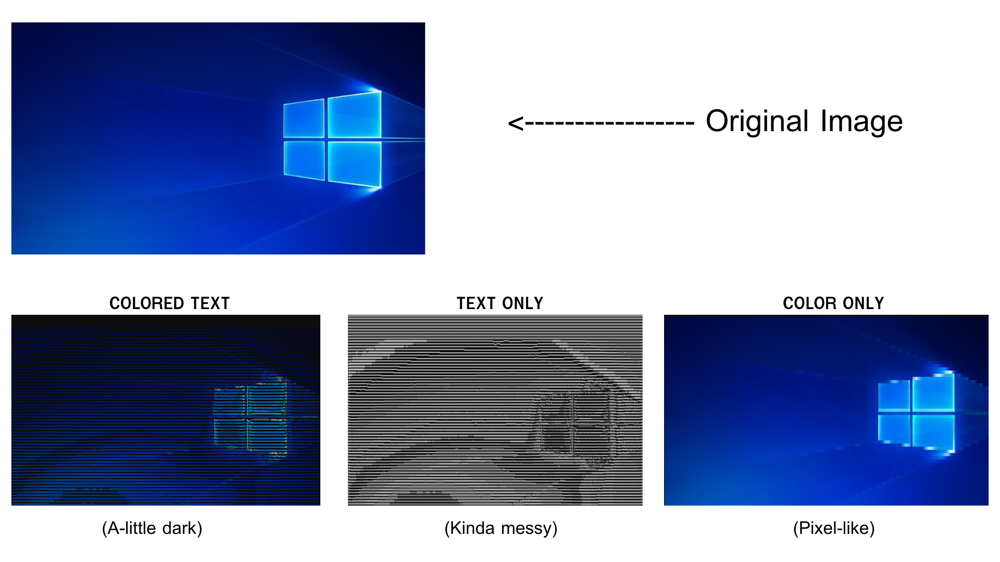

# Terminal Display for window
Projecting other window graphic in terminal with ascii-art for window


## Get Started
1. Open executable file
   bin > main.exe
   <br>

3. Program will ask you to open in new console. # Recommend
> NOTE
> This for some situation you run program through other console (it's better to open in console window)

4. Choose your style, The result preview :
  

5. Select your window by process id, blank for whole screen.
> NOTE
> A window that you would select must showed in screen (even behind from other window) NOT minimized <br> and rescaling the window before select it (when already selected a window size won't able to rescaling)

 
6. Enter the X skip pixel
7. Enter the Y skip pixel
   <br>(This tell program how many pixel that ignore before get 1 pixel data, <br>This 2 factors are define your output resolution by (OGresolutionX / Xskip) x (OGresolutionY / Yskip))

8. Running. While running the size of target window will fixed and set the z-index render to bottomest.
9. ESC to end. 

<br>

## Preview


<br>
<br>

## Requirement
- GNU Complier Collection (gcc)
- Make for build (Optional)
- Window os (win32, gdi32)

<br>

## Installation & Build

### build
```bash
# Build by .obj 
$ make setup

$ make
# or
$ make build

# Remove .obj & .exe file
$ make clean

# Build by .c
$ make f_build

```
